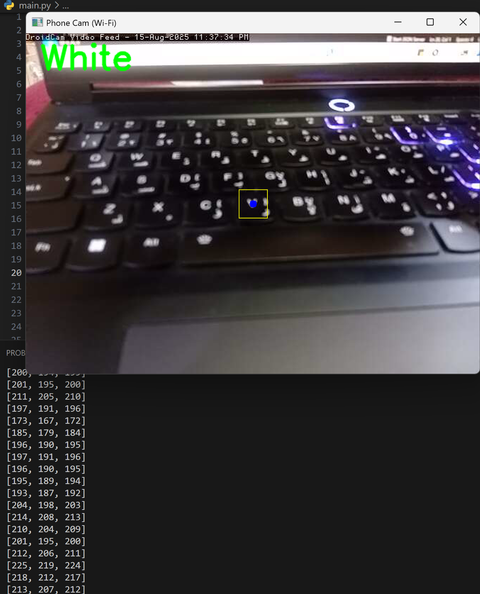

# color-recognition
A real-time color recognition system that uses OpenCV to detect and classify colors from a phone camera stream via WiFi or USB connection.

## ✨ Features

- 📱 Real-time color recognition from phone camera via WiFi or USB
- 🌈 Supports 8 different colors: Red, Green, Blue, Yellow, Orange, Purple, White, Black
- 🎯 Uses HSV color space for accurate color classification
- 🎥 Live video feed with color name overlay
- 💻 Cross-platform compatibility

## 📸 Demo

 
  
 <em>Black color recognition on keyboard</em>

 
  
 <em>White color recognition on surface</em>

## 📋 Requirements

- 🐍 Python 3.7+
- 📷 OpenCV (cv2)
- 🔢 NumPy
- 📱 DroidCam app on your phone
- 📶 WiFi connection or USB cable

## 🚀 Installation

1. Clone this repository:
\`\`\`bash
git clone https://github.com/s1ara1h/color-recognition.git
cd color-recognition
\`\`\`

2. Install required packages:
\`\`\`bash
pip install opencv-python numpy
\`\`\`

3. Install DroidCam app:
   - 📱 **Mobile**: [Google Play Store](https://play.google.com/store/apps/details?id=com.dev47apps.droidcam) | [App Store](https://apps.apple.com/app/droidcam/id1453312444)
   - 💻 **Desktop**: [Download from DroidCam website](https://www.dev47apps.com/droidcam/windows/)

## ⚙️ Setup

### 📶 WiFi Connection (Current setup):
1. Connect your phone and computer to the same WiFi network
2. Open DroidCam app on your phone
3. Note the IP address shown in the app
4. Update the IP address in the code:
\`\`\`python
IP = "192.168.xxx.xxx"  # Replace with your phone's IP
\`\`\`

### 🔌 USB Connection (Alternative):
1. Connect your phone to computer via USB cable
2. Enable USB debugging on your phone
3. Open DroidCam app on both phone and computer
4. Update the code for USB connection:
\`\`\`python
IP = "127.0.0.1"  # localhost for USB
PORT = 4747
\`\`\`

## 🎮 Usage

1. Start DroidCam on your phone
2. Run the program:
\`\`\`bash
python color_recognition.py
\`\`\`
3. Point your phone camera at different colored objects
4. The detected color name will appear on screen
5. Press 'q' or ESC to exit

## 🔬 How it Works

The system uses HSV (Hue, Saturation, Value) color space for color recognition:

1. 📹 **Camera Stream**: Receives video feed from phone via WiFi or USB
2. 🎯 **Color Sampling**: Takes pixel color from center of frame
3. 🔄 **HSV Conversion**: Converts BGR to HSV for better color recognition
4. 🏷️ **Classification**: Compares HSV values against predefined color ranges
5. 📺 **Display**: Shows result with visual indicators

## 🌈 Supported Colors

| Color | HSV Range |
|-------|-----------|
| 🔴 Red | (0-10, 120-255, 70-255) & (170-180, 120-255, 70-255) |
| 🟢 Green | (35-85, 80-255, 70-255) |
| 🔵 Blue | (90-130, 80-255, 70-255) |
| 🟡 Yellow | (20-35, 80-255, 70-255) |
| 🟠 Orange | (10-20, 80-255, 70-255) |
| 🟣 Purple | (130-160, 80-255, 70-255) |
| ⚪ White | (0-180, 0-40, 200-255) |
| ⚫ Black | (0-180, 0-255, 0-40) |

## 🛠️ Troubleshooting

**📱 Camera not connecting:**
- Check WiFi connection or USB cable
- Verify IP address is correct (WiFi) or use 127.0.0.1 (USB)
- Ensure DroidCam is running on phone and computer (for USB)

**🎯 Poor color recognition:**
- Ensure good lighting conditions
- Hold camera steady
- Try different distances from object

**💥 App crashes:**
- Check if all requirements are installed
- Verify Python version compatibility

## ⚙️ Configuration

You can modify color ranges in the \`COLOR_RANGES\` dictionary to improve recognition accuracy for your lighting conditions.

